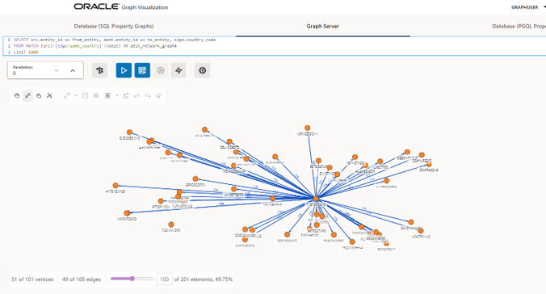

# Oracle Graph PGX - Pest Analysis Application

Graph database application for pest inspection prediction using Oracle Database with Oracle Graph PGX.
### Recreate all containers (rebuilds if Dockerfile changed)
docker compose up -d --force-recreate

### Recreate AND rebuild images from scratch
docker compose up -d --build --force-recreate

## Architecture

This application consists of two Docker containers:

1. **Oracle Database** (`oracle-db`): Oracle Database Free with Graph capabilities
2. **Python Application** (`python-app`): Python application using Oracle Graph PGX for graph analytics

## Prerequisites

- Docker and Docker Compose
- At least 8GB RAM available for Docker
- Pest data CSV file (`pest_data.csv`)

## Quick Start

### 1. Configure Environment

Copy the example environment file and customize if needed:
```bash
cp .env.example .env
```

Edit `.env` to change passwords or other settings (optional - defaults work out of the box).

### 2. Prepare Data

Place your `pest_data.csv` file in the `data/` directory with the following columns:
- `ENTY_ID`: Entity identifier
- `CTRY_CODE`: Country code
- `MONTH`: Month name
- `TARGET_PROXY`: Binary target (0=no pest, 1=pest)
- `ENTY_EXAMS_30D`, `ENTY_PESTS_30D`: 30-day examination metrics
- `ENTY_EXAMS_90D`, `ENTY_PESTS_90D`: 90-day examination metrics
- `ENTY_EXAMS_1YR`, `ENTY_PESTS_1YR`: 1-year examination metrics

### 3. Start the Application

```bash
# Build and start containers
docker-compose up -d

# View logs
docker-compose logs -f python-app

# Stop containers
docker-compose down

# Remove volumes (clean slate)
docker-compose down -v
```

### 4. Access Graph Studio UI

Oracle Graph Studio is available at:
- **URL**: https://localhost:7007/ui/
- **Username**: graphuser
- **Password**: Welcome1



### 5. Access the Database

Oracle Database will be available at:
- **Host**: localhost
- **Port**: 1521
- **Service Name**: FREE (data) / FREEPDB1 (PGX)
- **Graph User**: graphuser / Welcome1
- **Admin User**: sys / OraclePassword123

## Project Structure

```
graphdb_oracle/
├── docker-compose.yml          # Container orchestration
├── data/                        # Data directory (mount point)
│   └── pest_data.csv           # Input data file
├── oracle_db/                   # Oracle Database container
│   ├── Dockerfile
│   └── init/
│       └── 01_setup_graph.sql  # Database initialization
├── main_app/                    # Python application
│   ├── Dockerfile
│   ├── requirements.txt
│   ├── pest_analysis_classes.py          # Main analyzer class
│   ├── algo1_structural.py               # Structural features
│   ├── algo2_embeddings_node2vec.py      # DeepWalk embeddings
│   └── algo3_graphsage.py                # Supervised learning
└── README.md
```

## Graph Schema

### Vertex Tables
- `entities`: Primary entities being inspected
- `countries`: Country nodes
- `months`: Month nodes
- `target_proxies`: Binary target values (pest/no_pest)
- `country_months`: Composite country-month nodes
- `inspections`: Individual inspection records

### Edge Tables
- `shipped_in_edges`: Entity → Month
- `is_from_edges`: Entity → Country
- `has_weather_edges`: Entity → CountryMonth
- `has_inspection_result_edges`: Entity → TargetProxy

## Algorithms

### 1. Structural Features (`algo1_structural.py`)
Extracts graph topology features:
- Centrality measures: PageRank, Betweenness, Closeness, Eigenvector, Degree
- Triangle count and local clustering coefficient
- Community detection (conductance minimization)
- K-Core decomposition

### 2. Node Embeddings (`algo2_embeddings_node2vec.py`)
Generates learned node representations:
- DeepWalk (Oracle PGX equivalent to Node2Vec with p=1, q=1)
- 64-dimensional embeddings via random walks

### 3. Supervised Learning (`algo3_graphsage.py`)
Graph neural network for pest prediction:
- PGX GraphWise model (Oracle's GNN framework)
- DeepWalk embeddings for feature extraction
- Combines graph structure with pest labels

## Environment Variables

Configure via `docker-compose.yml` or `.env` file:

```bash
# Oracle Database
ORACLE_HOST=oracle-db
ORACLE_PORT=1521
ORACLE_SERVICE=GRAPHDB
ORACLE_USER=graphuser
ORACLE_PASSWORD=GraphPassword123

# PGX Server
PGX_BASE_URL=http://oracle-db:7007

# Data
CSV_FILE_PATH=/app/data/pest_data.csv
```

## Output Files

The application generates:
- `/app/pest_analysis.log`: Detailed logging
- `/app/graphwise_entity_features.csv`: ML features with embeddings
- `/app/pest_prediction_features.csv`: Graph features for prediction

## Troubleshooting

### Oracle Container Won't Start
- Ensure at least 8GB RAM is available
- Check logs: `docker-compose logs oracle-db`
- Wait 2-3 minutes for database initialization

### PGX Connection Errors
- Verify Oracle Graph is enabled
- Check PGX server is running on port 7007
- Ensure graph user has proper permissions

### Python Application Errors
- Check CSV file exists in `data/` directory
- Verify database is healthy: `docker-compose ps`
- Review logs: `docker-compose logs python-app`

## Converting from Neo4j

Original Neo4j code has been backed up as:
- `pest_analysis_classes_neo4j.py`
- `algo3_graphsage_neo4j.py`

Key differences:
- Neo4j Cypher → Oracle PGQL queries
- Neo4j GDS → Oracle PGX APIs
- GraphSAGE → PGX GraphWise/DeepWalk
- Bolt protocol → Oracle TNS/oracledb

## References

- [Oracle Graph Documentation](https://docs.oracle.com/en/database/oracle/property-graph/)
- [Oracle PGX API](https://docs.oracle.com/en/database/oracle/property-graph/23.1/spgdg/)
- [pypgx Python Client](https://pypi.org/project/pypgx/)
